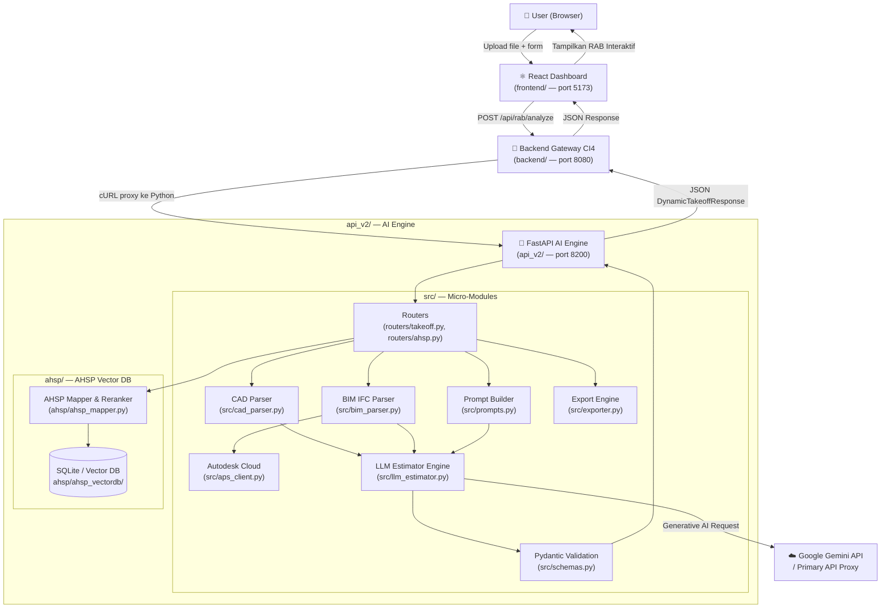
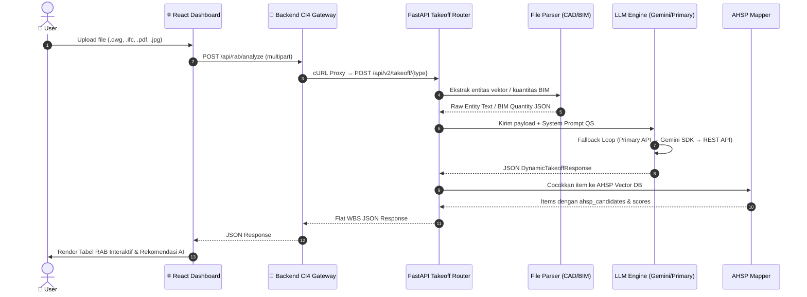

# Arsitektur Sistem & Alur Data Pipeline

Dokumen ini menjelaskan arsitektur sistem, tanggung jawab masing-masing modul, dan alur pemrosesan data dari **AI Construction Quantity Estimator & AHSP Matcher**.

---

## 1. Arsitektur Tingkat Tinggi

Sistem terdiri dari tiga komponen utama yang bekerja secara berurutan:

1. **Frontend (`frontend/`)**: Dashboard React 18 + Vite + TailwindCSS — antarmuka pengguna untuk upload file, manajemen proyek, visualisasi RAB, dan seleksi kandidat AHSP.
2. **Backend Gateway (`backend/`)**: CodeIgniter 4 (PHP) — API gateway yang menerima request dari frontend, memvalidasi file, dan meneruskannya ke Python AI Engine via cURL.
3. **AI Engine (`api_v2/`)**: FastAPI Python — engine inti yang memproses parsing CAD/BIM, orkestrasi AI Gemini, dan semantic matching AHSP.

---

## 2. Alur Data Pipeline

Saat pengguna mengupload file gambar konstruksi (DWG/DXF, IFC/Revit, PDF, atau Image), sistem memprosesnya melalui 7 tahap pipeline:

### Detail Tiap Tahap

1. **Upload & Proxy** — Frontend mengirim file ke Backend CI4 (`POST /api/rab/analyze`). CI4 memvalidasi tipe file dan ukuran, lalu meneruskan ke Python FastAPI via cURL multipart.

2. **Ekstraksi (Parsing)**:
   - **DWG/DXF**: Di-parse oleh `src/cad_parser.py` menggunakan `ezdxf` / `dwg2dxf` untuk mengekstrak layer, teks anotasi, dimensi, dan schedule table.
   - **BIM (.ifc, .rvt)**: Diproses oleh `src/bim_parser.py` via `ifcopenshell`, atau dikonversi melalui Autodesk Platform Services di `src/aps_client.py`.
   - **PDF/Image**: Diteruskan langsung ke Gemini Multimodal Vision API.

3. **Prompt Building** — `src/prompts.py` membangun system prompt dan user prompt yang menegakkan aturan Quantity Surveyor Indonesia: konversi unit mm/cm ke meter, volume positif (> 0.0), dan prefix AHSP standar (`Pemasangan`, `Penggalian`, `Pengecoran`, dll.).

4. **Orkestrasi LLM** — `src/llm_estimator.py` mengelola fallback multi-tier:
   1. Primary OpenAI-compatible API (jika dikonfigurasi)
   2. Google Gemini SDK (`genai.Client`) — loop model
   3. HTTP REST API Gemini langsung

   Termasuk stripping tag `<think>` dan JSON repair otomatis.

5. **Schema Validation** — `src/schemas.py` memvalidasi output model menjadi `DynamicTakeoffResponse`, `EstimateSection`, dan `EstimateItem` via Pydantic V2.

6. **AHSP Mapping & Reranking** — `ahsp/ahsp_mapper.py` mencocokkan setiap item pekerjaan ke database AHSP Indonesia menggunakan semantic embedding, action-verb filtering, dan candidate reranking.

7. **Rendering Frontend** — `Anggaran.jsx` merender header seksi dan item WBS, menampilkan badge confidence (`mapped_high`, `mapped_medium`, `unmapped`), dan popover interaktif untuk `ahsp_candidates`.

---

## 3. Tanggung Jawab Tiap Layer

| Layer | Direktori | Port | Teknologi | Peran |
|---|---|:---:|---|---|
| **Frontend** | `frontend/` | 5173 | React 18, Vite, TailwindCSS | UI Dashboard — upload, RAB, export |
| **Backend Gateway** | `backend/` | 8080 | PHP 8.2+, CodeIgniter 4 | API gateway, validasi file, proxy ke Python |
| **AI Engine** | `api_v2/` | 8200 | Python, FastAPI, Uvicorn | Parsing, AI takeoff, AHSP mapping |

---

## 4. Tanggung Jawab Micro-Modules di `api_v2/src/`

| Modul | File | Tanggung Jawab |
|---|---|---|
| **`schemas`** | `src/schemas.py` | Pydantic schemas (`DynamicTakeoffResponse`, `EstimateItem`, `BIMElementQuantity`, dll.) |
| **`prompts`** | `src/prompts.py` | System prompts & user prompt builders untuk CAD, PDF, Image, dan BIM |
| **`aps_client`** | `src/aps_client.py` | Autodesk Cloud (APS) — OAuth, upload, SVF2 job, property extraction |
| **`bim_parser`** | `src/bim_parser.py` | Parser OpenBIM IFC via `ifcopenshell`, orkestrasi konversi Revit |
| **`cad_parser`** | `src/cad_parser.py` | Ekstraksi entitas vektor DWG/DXF/SVG/PLT |
| **`llm_estimator`** | `src/llm_estimator.py` | LLM execution engine: multi-tier fallback + JSON repair |
| **`exporter`** | `src/exporter.py` | Export RAB ke Excel (`.xlsx`, 2 sheet) atau JSON |
| **`inspect_raw_pipeline`** | `src/inspect_raw_pipeline.py` | CLI debug inspector — test parsing & takeoff tanpa HTTP server |
| **`ahsp_mapper`** | `ahsp/ahsp_mapper.py` | Semantic embedding search & reranking ke AHSP Vector DB |
