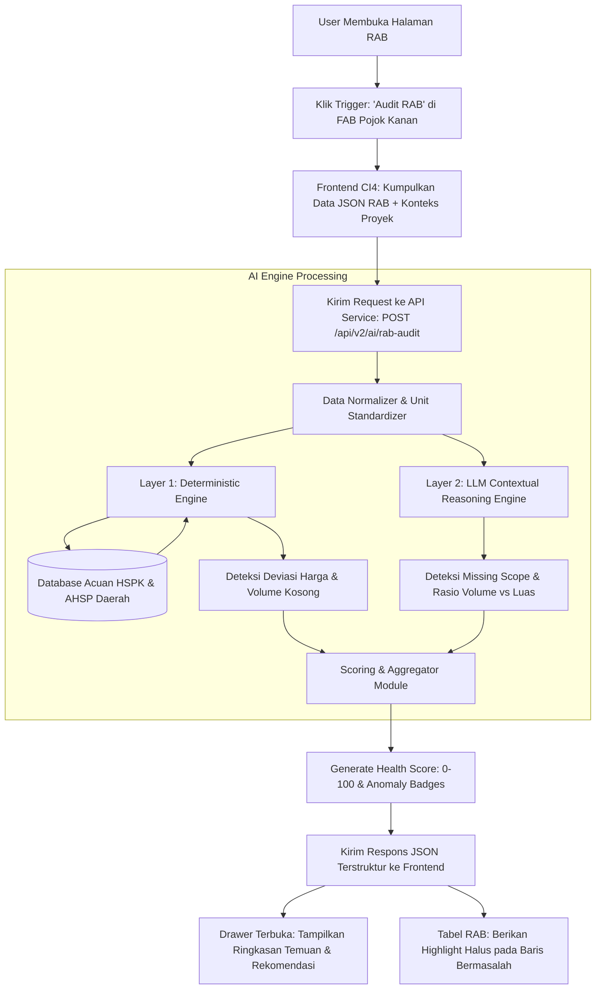

# Product Requirement Document (PRD): AI RAB Auditor

| Metadata | Detail |
| :--- | :--- |
| **Produk** | Estimator.id |
| **Fitur** | AI RAB Auditor (Scanner & Validasi Otomatis) |
| **Dokumen** | Product Requirement Document (PRD) |
| **Versi** | 1.0.0 |
| **Status** | Proposed / Ready for Development |
| **Target Rilis** | Q4 2026 / Sprint Fitur AI Lanjutan |
| **Lokasi File** | `docs/PRD_RAB_AUDITOR.md` |

---

## 1. Latar Belakang & Problem Statement

### 1.1 Masalah Saat Ini
Penyusunan Rencana Anggaran Biaya (RAB) bangunan secara manual di industri konstruksi (*AEC*) sangat rentan terhadap kesalahan manusia (*human error*), antara lain:
1. **Kesalahan Volume & Nilai Nol**: Kolom volume belum terisi (`0.00`) atau salah ketik rumus luas/volume yang menyebabkan pembengkakan atau defisit anggaran.
2. **Anomali Harga Satuan Material & Upah**:
   * *Overpricing* (markup tidak wajar): Menyebabkan penawaran tender kalah kompetitif atau owner membayar terlalu mahal.
   * *Underpricing* (harga terlalu murah/banting harga): Berisiko material tidak sesuai spesifikasi atau proyek mangkrak di tengah jalan.
3. **Pekerjaan Terlewat (*Missing Scope*)**: Adanya pekerjaan utama tanpa item pendukung wajib. Contoh klasik:
   * Ada pekerjaan *Pengecoran Beton Bertulang*, tetapi tidak mencantumkan item *Pembesian (Besi Beton)* atau *Bekisting*.
   * Ada pekerjaan *Pasang Dinding Bata*, tetapi tidak ada pekerjaan *Plesteran* dan *Acian*.

### 1.2 Solusi: AI RAB Auditor
Modul AI RAB Auditor adalah mesin validator otomatis yang membaca dokumen RAB proyek di Estimator.id, menganalisis kelayakan volume, harga, dan kelengkapan item berdasarkan lokasi dan spesifikasi proyek, lalu menyajikan **Health Score** serta rekomendasi perbaikan dalam hitungan detik.

---

## 2. Tujuan Produk & Metrik Keberhasilan (Goals & KPIs)

### 2.1 Tujuan Produk
* Memberikan kepastian akurasi bagi Quantity Surveyor (QS) dan Kontraktor sebelum RAB diajukan ke klien.
* Menjadikan Estimator.id sebagai platform pintar (*intelligent estimator*) terdepan yang tidak hanya mencatat angka, tetapi memvalidasi kelayakan teknis dan ekonomisnya.
* Menjadi fondasi modular (*diagnostic tools*) yang nantinya akan digunakan oleh **AI Agent/Copilot**.

### 2.2 Success Metrics (KPIs)
* **Kecepatan Audit**: Waktu eksekusi audit ≤ 4.0 detik untuk dokumen hingga 200 baris item pekerjaan.
* **Akurasi Deteksi Anomali**: F1-Score ≥ 85% untuk pendeteksian harga di luar ambang batas HSPK daerah.
* **Tingkat Adopsi Pengguna**: ≥ 65% proyek aktif menggunakan fitur "Audit RAB" sebelum mengekspor/mencetak dokumen RAB.
* **Zero Critical Miss**: 100% item dengan volume `0.00` dan harga `0.00` terdeteksi secara instan.

---

## 3. Target Pengguna (User Persona)

1. **Quantity Surveyor (QS) / Estimator**:
   * *Kebutuhan*: Memeriksa ratusan baris RAB dengan cepat tanpa harus cek manual satu per satu ke buku standar harga daerah.
2. **Kontraktor / Pemborong Proyek**:
   * *Kebutuhan*: Memastikan margin keuntungan realistis dan mencegah kerugian akibat lupa menghitung material pendukung.
3. **Pemilik Proyek (Project Owner / Klien)**:
   * *Kebutuhan*: Transparansi biaya; memastikan harga yang ditawarkan kontraktor masuk akal dan sesuai standar pasar daerah proyek.

---

## 4. End-to-End System Workflow

Berikut alur kerja pemindaian data RAB dari awal sampai ke tampilan pengguna:



---

## 5. Technology Stack

| Layer / Kebutuhan | Teknologi | Rationale & Alasan |
| :--- | :--- | :--- |
| **Backend Web & UI** | **PHP 8.x + CodeIgniter 4** | Stack aplikasi utama yang sudah berjalan (`backend/`). |
| **AI / Microservice API** | **Python 3.10+ & FastAPI** | Performa tinggi (*async*), terintegrasi rapi dengan modul `api_v2/` yang sudah ada di proyek. |
| **LLM Reasoning Engine** | **Gemini 2.5 Flash / 1.5 Flash** (via `google-genai` SDK) | Konteks besar (mampu memproses ratusan item RAB sekaligus), latensi rendah, biaya token sangat efisien, dan mendukung *Structured Outputs* (JSON Schema). |
| **Database Referensi Harga** | **MySQL (Eksisting)** / SQLite Cache | Menyimpan tabel standar HSPK (Harga Satuan Pokok Kegiatan) dan AHSP PUPR/SNI per kabupaten/kota. |
| **String & Item Matching** | `RapidFuzz` / `Sentence-Transformers` | Menghubungkan variasi nama pekerjaan di lapangan dengan kode AHSP resmi secara cepat. |
| **Frontend Interaction** | Vanilla JS / Tailwind CSS (atau Bootstrap eksisting) | Ringan, interaktif untuk animasi slide-over drawer dan popover tooltip tanpa memberatkan render tabel. |

---

## 6. Logika Validasi (Dual-Validation Architecture)

Untuk menghindari halusinasi LLM dan memastikan keandalan angka, audit dibagi menjadi 2 layer:

### Layer 1: Deterministic Engine (Berbasis Database & Aturan Pasti)
1. **Pengecekan Volume Kosong / Nol**:
   * Jika `volume == 0.00` atau `volume == null` pada item berbayar → Status: `CRITICAL`.
2. **Pengecekan Deviasi Harga Satuan**:
   * Sistem mencocokkan nama item dan satuan ke database HSPK lokasi proyek (misal: Kab. Sleman / DKI Jakarta).
   * Menghitung persentase deviasi:
     $$\Delta = \frac{\text{Harga Satuan User} - \text{Harga Standar HSPK}}{\text{Harga Standar HSPK}} \times 100\%$$
   * Ambang batas (*Thresholds*):
     * $-15\% \le \Delta \le +15\%$ : 🟢 **Normal (Wajar)**
     * $+15\% < \Delta \le +35\%$ : 🟡 **Warning: Overpriced Ringan**
     * $\Delta > +35\%$ : 🔴 **Critical: Overpriced Berat (Indikasi Markup)**
     * $\Delta < -25\%$ : 🟡 **Warning: Underpriced (Risiko Mutu / Mangkrak)**

### Layer 2: LLM Contextual Reasoning (Berbasis Pemahaman Konstruksi)
1. **Missing Scope Detection (Keterkaitan Antar Pekerjaan)**:
   * Prompt LLM dilengkapi *knowledge base* logika konstruksi untuk memeriksa apakah ada item wajib yang hilang.
   * Contoh: Kategori pekerjaan struktur beton bertulang wajib memiliki item:
     * Beton (Ready mix / Site mix)
     * Besi Tulangan (kg)
     * Bekisting (m²)
2. **Volume Sanity vs Building Footprint**:
   * LLM membandingkan total volume dengan luas bangunan di konteks proyek:
   * Contoh: Rumah 1 lantai luas 60 m², volume cat dinding tertera 800 m² → LLM menandai sebagai *Outlier Volume* (rasio dinding rumah standar adalah 2.5x – 3.5x luas lantai).

---

## 7. Spesifikasi Fungsional (Functional Requirements)

### FR-1: Pemicu Audit Bersih & Minimalis
* Tidak menambah tombol baru yang memenuhi toolbar atas tabel.
* Disediakan **Floating Action Button (FAB)** di pojok kanan bawah layar bertuliskan `[✨ Asisten AI]`.
* Ketika diklik, panel samping kanan (*Slide-over Drawer*) terbuka dan otomatis menampilkan tab **"Audit Kelayakan"**.

### FR-2: Perhitungan RAB Health Score
* Skor berkisar antara **0 hingga 100**.
* **Aturan Pengurangan Skor**:
  * Baseline awal: 100 poin.
  * Setiap temuan `CRITICAL` (Volume 0, Harga > 50% di atas pasar): kurangi 15 poin.
  * Setiap temuan `WARNING` (Harga selisih 20-35%): kurangi 5 poin.
  * Setiap temuan `MISSING_SCOPE`: kurangi 10 poin.
  * Nilai minimum skor: 0.

### FR-3: Visual Highlighting pada Tabel RAB
* Baris item yang bermasalah mendapatkan penanda visual:
  * Kolom Volume atau Harga Satuan diberi badge kecil: ⚠️ (Kuning) atau 🔴 (Merah).
  * Latar belakang baris diberi *tint* warna sangat tipis (misal: `#FFFBEB` untuk warning).
* Saat kursor diarahkan (*hover*) ke badge, muncul tooltip berisi:
  * Masalah yang terdeteksi.
  * Perbandingan harga standar pasar.
  * Rekomendasi tindakan.

### FR-4: Laporan Audit Lengkap (Side Drawer)
Panel samping memuat:
1. **Header**: Skor Kesehatan RAB (*Health Score*) dalam bentuk gauge melingkar berwarna hijau/kuning/merah.
2. **Ringkasan Cepat**: Total item diperiksa, jumlah error kritis, jumlah peringatan harga, dan pekerjaan yang hilang.
3. **Daftar Temuan Terperinci**: Kartu-kartu temuan yang dapat diklik untuk langsung melompat (*scroll*) ke baris tabel terkait.
4. **Tombol Aksi**:
   * `[ 🔄 Audit Ulang ]`
   * `[ 📥 Unduh Laporan Audit (PDF) ]`

---

## 8. UI / UX Design Wireframe

### Tampilan Layar Utama (Tabel Bersih + FAB)
```
+------------------------------------------------------------------------------------------+
| [LOGO] ESTIMATOR.ID             Proyek    Hasil Deteksi    RAB    API Docs    (User)     |
+------------------------------------------------------------------------------------------+
| [ BANNER PROYEK: RENOVASI RUMAH TINGGAL ]                                                |
+------------------------------------------------------------------------------------------+
|                                                      Cari Data: [_____________________]  |
|                                                                                          |
|  No.  Uraian Pekerjaan          Kode AHSP   Volume    Sat.   Harga Satuan   Total        |
|  --------------------------------------------------------------------------------------  |
|  [-]  PEKERJAAN STRUKTUR BETON                                                           |
|   1   Pengecoran Beton K-250     2.2.1.6.1   0.00 🔴   m3     Rp 1.850.000 🟡  Rp 0      |
|   2   Pemasangan Bekisting       2.2.1.4.2   45.00     m2     Rp   165.000    Rp 7.42jt  |
|                                                                                          |
|                                                                       +----------------+ |
|                                                                       | ✨ AI ASISTEN  | |
|                                                                       |  (2 Peringatan)| |
|                                                                       +----------------+ |
+------------------------------------------------------------------------------------------+
```

### Tampilan Saat Panel Samping Terbuka (Slide-over Drawer)
```
+-------------------------------------------------------------+----------------------------+
| Tabel RAB Utama (Agak redup / fokus tetap terjaga)          | ✨ AI AUDITOR HASIL    [X] |
|                                                             |----------------------------|
|                                                             | [  SKOR KESEHATAN RAB   ]  |
|                                                             |           74 / 100         |
|                                                             |   Status: Perlu Tinjauan   |
|                                                             |----------------------------|
|                                                             | 🔴 1 Isu Kritis            |
|                                                             | 🟡 2 Peringatan Harga      |
|                                                             | ⚠️ 1 Item Hilang           |
|                                                             |----------------------------|
|                                                             | DETAIL ANOMALI:            |
|                                                             | [🔴] Cor Beton K-250       |
|                                                             |   • Masalah: Volume 0.00   |
|                                                             |   • Rekomendasi: Isi vol   |
|                                                             |                            |
|                                                             | [🟡] Harga Beton K-250     |
|                                                             |   • User: Rp 1.850.000/m3  |
|                                                             |   • Standar: Rp 1.250.000  |
|                                                             |                            |
|                                                             | [⚠️] Item Wajib Terlewat:  |
|                                                             |   • Belum ada Pembesian    |
|                                                             |     Besi Beton di Struktur |
|                                                             |----------------------------|
|                                                             | [ 🔄 Jalankan Ulang Audit ]|
+-------------------------------------------------------------+----------------------------+
```

---

## 9. API Data Contract

### Endpoint: `POST /api/v2/ai/rab-audit`

#### Request Payload
```json
{
  "project_id": "662adb9b-1591-4189-b91b-4cd039869181",
  "project_context": {
    "project_name": "Renovasi Rumah",
    "building_type": "Rumah Tinggal",
    "location": {
      "province": "DI Yogyakarta",
      "city_regency": "Kabupaten Sleman"
    },
    "building_area_m2": 120.0,
    "number_of_floors": 2,
    "currency": "IDR"
  },
  "items": [
    {
      "id": 1,
      "category": "PEKERJAAN STRUKTUR BETON BERTULANG",
      "description": "Pengecoran Beton menggunakan Ready Mixed K-250",
      "ahsp_code": "2.2.1.6.1",
      "volume": 0.0,
      "unit": "m3",
      "unit_price": 1850000.0,
      "total_price": 0.0
    },
    {
      "id": 2,
      "category": "PEKERJAAN STRUKTUR BETON BERTULANG",
      "description": "Pemasangan Bekisting untuk Balok",
      "ahsp_code": "2.2.1.4.2",
      "volume": 45.0,
      "unit": "m2",
      "unit_price": 165000.0,
      "total_price": 7425000.0
    }
  ]
}
```

#### Response Payload
```json
{
  "status": "success",
  "data": {
    "audit_timestamp": "2026-09-18T10:30:00Z",
    "health_score": 74,
    "health_status": "NEEDS_REVIEW",
    "summary": {
      "total_items_checked": 2,
      "critical_count": 1,
      "warning_count": 1,
      "missing_scope_count": 1
    },
    "anomalies": [
      {
        "item_id": 1,
        "type": "VOLUME_ZERO",
        "severity": "CRITICAL",
        "field": "volume",
        "message": "Volume pekerjaan bernilai 0.00 m3 pada item terdaftar.",
        "recommendation": "Isi estimasi volume beton sesuai dimensi balok & kolom proyek."
      },
      {
        "item_id": 1,
        "type": "PRICE_OVERPRICED",
        "severity": "WARNING",
        "field": "unit_price",
        "current_value": 1850000.0,
        "benchmark_value": 1250000.0,
        "deviation_percent": 48.0,
        "message": "Harga satuan lebih tinggi 48% dari rata-rata HSPK Kab. Sleman.",
        "recommendation": "Pertimbangkan harga acuan pasar di rentang Rp 1.200.000 - Rp 1.350.000 / m3."
      }
    ],
    "missing_scopes": [
      {
        "category": "PEKERJAAN STRUKTUR BETON BERTULANG",
        "missing_item": "Pembesian Besi Beton (Polos / Ulir)",
        "confidence": 0.95,
        "reason": "Ditemukan pekerjaan pengecoran beton dan bekisting, namun tidak ditemukan item pekerjaan pembesian."
      }
    ]
  }
}
```

---

## 10. Persyaratan Non-Fungsional (Non-Functional Requirements)

1. **Performa & Latensi**:
   * Respons audit selesai dalam < 4 detik untuk 200 baris item.
   * Menggunakan caching untuk data acuan HSPK agar tidak membebani database setiap kali audit dipanggil.
2. **Data Privacy & Keamanan**:
   * Data RAB klien tidak dikirimkan ke model publik untuk keperluan pelatihan model pihak ketiga (*Zero Training Data Retention*).
   * Seluruh pertukaran data API dienkripsi melalui protokol HTTPS.
3. **Resiliensi & Graceful Fallback**:
   * Jika sambungan internet ke LLM (Gemini API) terganggu atau timeout, sistem otomatis beralih ke **Fallback Mode** (menjalankan Layer 1 Deterministic Engine saja) sehingga pengguna tetap mendapatkan info volume kosong dan deviasi harga standar.

---

## 11. Roadmap Implementasi Bertahap

```
[Sprint 1: Database & Engine Dasar] ──> [Sprint 2: LLM & Scoring] ──> [Sprint 3: UI & Integrasi]
```

### Sprint 1: Foundation & Deterministic Engine (Minggu 1)
- [x] Susun database acuan HSPK / AHSP standar per kabupaten/provinsi.
- [ ] Buat modul Python di `api_v2/` untuk validasi harga satuan dan pengecekan volume `0`.
- [ ] Implementasikan endpoint FastAPI `POST /api/v2/ai/rab-audit`.

### Sprint 2: LLM Contextual Reasoning & Scoring (Minggu 2)
- [ ] Integrasikan Gemini API untuk analisis korelasi item (*Missing Scope*).
- [ ] Implementasikan rumus kalkulasi *RAB Health Score* (0 - 100).
- [ ] Buat unit test dan benchmark akurasi deteksi anomali.

### Sprint 3: UI/UX Implementation di CodeIgniter 4 (Minggu 3)
- [ ] Pasang Floating Action Button (FAB) `[✨ Asisten AI]` di view `anggaran.php`.
- [ ] Buat komponen Slide-over Drawer untuk menyajikan Health Score dan daftar temuan.
- [ ] Tambahkan highlight badge (🟡 / 🔴) dan popover tooltip pada baris tabel yang terkena flag.
- [ ] Hubungkan tombol "Jalankan Audit" dengan endpoint FastAPI secara asynchronous (AJAX/Fetch).
